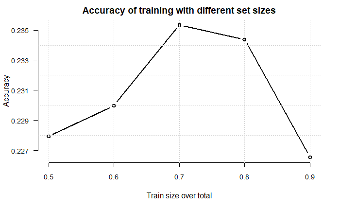
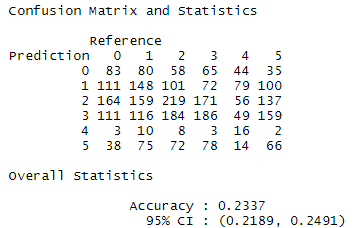
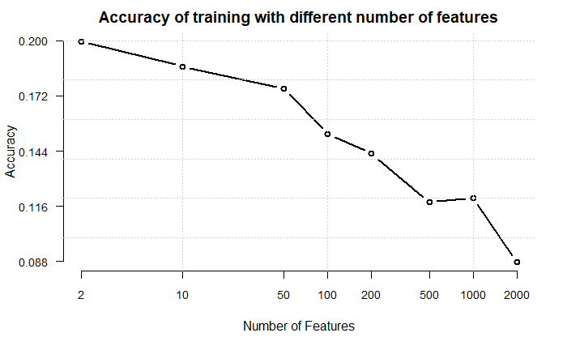
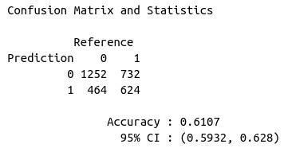
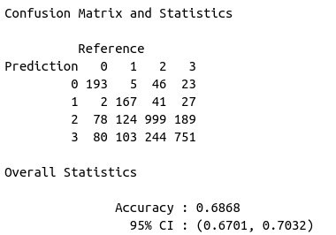

Naive Bayes classifer for Fake News recognition
================
De Masi Michele, Sbarbati Riccardo
2022-07-18

## Introduction

Fake News are nowdays the most common source of disinformation.

Being able to distinguish fake contents form real news is today one of
the most serious challenges facing the news industry.

This project studies the effect of a Naive Bayes Classifier algorithm on
a typical fake news recognition problem.

## Introduction

-   Structure of the data set;  

-   Text Classification and Naive Bayes;  

-   Training Algorithm;  

-   Testing Algorithm;  

-   Feature Selection and Mutual Information;  

-   Relabeling;  

-   Final consideration.

## Data structure

The data is taken from the KAGGLE Fake News Content Detection dataset,
which contains 10240 instances, labelled as follows:

-   True: 5;

-   Not known: 4;

-   Mostly True: 3;

-   Half True: 2;

-   False: 1;

-   Barely True: 0.

## Training set example


## Text Classification

The problem of Text Classification falls under the “supervised learning”
category of ML.

The elements of the sample space

are documents that need to be assigned to one class belonging to the
fixed size class space
.
From a training set of labeled documents

one wishes, using a learning method, to learn a classification function

that maps documents to classes:


## Naive Bayes text classification

The probability of a document

being in class

is defined as:

\varpropto P(c) \prod_{1\leq k \leq n_d}P(t_k | c)")

The best class in NB classification is the

(MAP) class
:

=\arg \max_{c \in \mathbb{C}}\hat{P}(c) \prod_{1\leq k \leq n_d}\hat{P}(t_k | c)")

It is better to perform using the logarithms of the probabilities.

![ c\_{map}= \\arg \\max\_{c \\in \\mathbb{C}} \[\\log\\hat{P}(c) + \\sum\_{1\\leq k \\leq n_d}\\log\\hat{P}(t_k \| c)\]](https://latex.codecogs.com/png.image?%5Cdpi%7B110%7D&space;%5Cbg_white&space;%20c_%7Bmap%7D%3D%20%5Carg%20%5Cmax_%7Bc%20%5Cin%20%5Cmathbb%7BC%7D%7D%20%5B%5Clog%5Chat%7BP%7D%28c%29%20%2B%20%5Csum_%7B1%5Cleq%20k%20%5Cleq%20n_d%7D%5Clog%5Chat%7BP%7D%28t_k%20%7C%20c%29%5D " c_{map}= \arg \max_{c \in \mathbb{C}} [\log\hat{P}(c) + \sum_{1\leq k \leq n_d}\log\hat{P}(t_k | c)]")

## Naive Bayes method

The prior is the maximum likelihood estimate:

 = \frac{N_c}{N}")

:
number of documents in
;
:
total number of documents.

The conditional probability is estimated as:

= \frac{T_{ct}}{\sum_{t' \in V}T_{ct'}}")

:
the number of occurrences of token

in all training documents from class
.

## Sparseness & Laplace Smoothing

The MLE has the problem of
:
the training data are never large enough to represent the frequency of
rare events adequately.  
The solution of this problem is to use

or

:

= \frac{T_{ct}+1}{\sum_{t' \in V}(T_{ct'}+1)}= \frac{T_{ct}+1}{(\sum_{t' \in V}T_{ct'})+B}")

where
.

## Clean Data set & Vocabulary building function

``` r
clean.data <- function(data.set) {
  data.set <- gsub("([(.,)?!\"])",'',data.set)
  data.set <- gsub("('s )",' ',data.set)
  data.set <- gsub("(' )",' ',data.set)
  data.set <- gsub("( ')",' ',data.set)
  data.set <- gsub("\\[",' ',data.set)
  data.set <- gsub("\\]",' ',data.set)
  data.set <- tolower(data.set)
  data.set <- strsplit(data.set, " ")
  return(data.set)
}

stop.words <- c("", "--", "#",NA,"ha")
stop.words <- c(stopwords(source = "snowball"),stop.words)

extract.vocabulary <- function(train.data, stop.words) {
  V <- unique(unlist(train.data))
  V <- V[V %in% stop.words == FALSE]
  return(V)
}
```

## Naive Bayes method: Train algorithm

``` r
N <- length(train_data)
Nc <- count.docs.in.class(labels, classes)
prior <- Nc / N

train.Bayes.Mult <- function(train.data, V, labels, classes) {
  
  cond.prob <- matrix(0, nrow = length(V), ncol = length(classes))
  for (c in classes) {
    
    text.c <- concatenate.text(train.data, c, labels)
    T.ct <- unlist(map(V,count.tokens.t, text.c))
    summ <- sum(T.ct)
    D <- summ + length(V)
    
    cond.prob[,c+1] <- unlist(map(T.ct,compute.cond.prob,D))
  }
  return(cond.prob)
}
```

## Naive Bayes method: Test algorithm

``` r
predict.Bayes.Mult<-function(d,V,prior,cond.prob,classes) {
  W <- extract.tokens(unlist(d),unlist(V))
  score <- log(prior)
  
  if (length(W) != 0) {
    for (c in classes) {
      for (i in 1:length(W)) {
        ind <- match(W[i],V, nomatch = -1)
        if (ind != -1) {
          score[c+1]<-score[c+1]+log(cond.prob[ind,c+1])
        }
      }
    }
  }
  return(score)
}
```

## Results

The train algorithm is run using all the training set, and the accuracy
is computed by testing all the train set over itself.

1.  The data are read, cleaned and the vocabulary is extracted

``` r
data <- data.frame(read.csv('train.csv'))
data_test <- data.frame(read.csv('test.csv'))
train_data <- data$Text
test_data <- data_test$Text
labels <- data$Labels
classes <- 0:5
```

``` r
prepare.data <- function(train_data, stop.words) {
  train.data <- clean.data(train_data)
  V <- extract.vocabulary(train.data, stop.words)
  return(list(train.data,V))
}
prep <- prepare.data(train_data,stop.words)
train.data <- prep[[1]]
Voc <- prep[[2]]
```

## Results

The train algorithm is run using our all training set, and it is
calculated the accuracy testing all the train set over itself.

2.  Having the data the algorithm should be run

``` r
Cond.Prob <- train.Bayes.Mult(train.data, Voc, labels, classes)
```

``` r
preds.1 <- map(train.data,predict.Bayes.Mult,Voc.feat, prior, Cond.Prob, classes)
preds <- unlist(map(preds.1,which.max)) - 1

check <- preds == labels
accuracy <- sum(check, na.rm = TRUE)/length(preds)
```

Comparing the predicted labels with the true ones the accuracy is:


## Results



## Result: Confusion Matrix



## Feature selection

Restriction of the terms used in text classification only to a subset
containing the most meaningful ones for each class.

-   More efficient training and prediction processes;

-   Eliminates
    ;

-   Reduces overfitting;

For an order

feature selection, for a given class
,
an utility measure
")
is computed for each term of the vocabulary, and only the

tokens with the highest utility are selected for classification.

## Mutual Information

 = I(U_t;C_c)")


(MI) is a measure of how much information the presence/absence of a
token contributes to making the correct classification decision on
.

 = \sum_{e_t \in \{1,0\}} \sum_{e_c \in \{1,0\}} P(U = e_t,C = e_c) \log_2 \frac{P(U = e_t,C = e_c)}{P(U = e_t)P(C = e_c)}")


is the random variable that indicates if the document contains the token

or not, and

indicates if the document belongs to class

or not.

## Mutual Information

 = \frac{N_{11}}{N} \log_2 \frac{N N_{11}}{N_{1.}N_{.1}} + \frac{N_{01}}{N} \log_2 \frac{N N_{01}}{N_{0.}N_{.1}} ")


## Mutual Information Estimator

``` r
in.f <- function(d,t) {
  t %in% d
}

mutual.information.best <- function(t,c,train.data,labels) {
  N1. <- unlist(lapply(train.data,in.f,t))
  N.1 <- labels == c
  
  N_11 <- sum(N1. & N.1) + 1
  N_00 <- sum(!N1. & !N.1) + 1
  N_10 <- sum(N1. & !N.1) + 1
  N_01 <- sum(!N1. & N.1) + 1
  
  N <- N_00 + N_01 + N_10 + N_11 - 4
  m.i <- (N_11/N)*log2((N*N_11)/((N_10 + N_11)*(N_01 + N_11))) + 
    (N_01/N)*log2(N*N_01/((N_01 + N_00)*(N_01 + N_11))) + 
    (N_10/N)*log2(N*N_10/((N_10 + N_11)*(N_10 + N_00))) + 
    (N_00/N)*log2(N*N_00/((N_00 + N_01)*(N_10 + N_00)))
  return(m.i)
}
```

## Feature selection Algorithm

``` r
create_Vc <- function(V, mut.info, n_features) {
  Vc <- V[order(mut.info,decreasing=T)]
  return(Vc[1:n_features])
}

build.feat.sel <- function(train.data, labels, classes, stop.words, n_features=100) {
  V <- extract.vocabulary(train.data, stop.words)
  V_c <- matrix(0, nrow = n_features, ncol = length(classes))
  for (c in classes) {
    mutual.info.c <- map(V,mutual.information.best,c,train.data,labels)
    V_c[,c+1] <- unlist(create_Vc(V,unlist(mutual.info.c),n_features))
  }
  return(V_c)
}
```

## Training with Feature selection

``` r
train.Bayes.Mult.Feat <- function(train.data, V, labels, classes,
                                  V_c = numeric(), feat.sel = TRUE) {
  
  if (feat.sel) {
    cond.prob <- matrix(0, nrow = length(V_c[,1]), ncol = length(classes))
  } else {
    cond.prob <- matrix(0, nrow = length(V), ncol = length(classes))
  }
  
  for (c in classes) {
    
    if (feat.sel) {
      V. <- V_c[,c+1]
    } else {
      V. <- V
    }
    
    text.c <- concatenate.text(train.data, c, labels)
    
    T.ct <- unlist(map(V.,count.tokens.t, text.c))
    
    summ <- sum(T.ct)
    D <- summ + length(V.)
    
    cond.prob[,c+1] <- unlist(map(T.ct,compute.cond.prob,D))
    
  }
  return(list(cond.prob, V_c))
}
```

## Testing with Feature selection

``` r
predict.Bayes.Mult.Feat <- function(d, V, V_c, prior, cond.prob,
                                    classes, feat.sel = TRUE) {
  W <- extract.tokens(unlist(d),unlist(V))
  score <- log(prior)
  
  if (length(W) != 0) {
    for (c in classes) {
      if (feat.sel) {
        V. <- V_c[,c+1]
      } else {
        V. <- V
      }
      for (i in 1:length(W)) {
        ind <- match(W[i],V., nomatch = -1)
        if (ind != -1) {
          score[c+1] <- score[c+1] + log(cond.prob[ind,c+1])
        }
      }
    }
  }
  return(score)
}
```

## Results with the Feature selection

``` r
V_c <- build.feat.sel(train_data, labels, classes, stop.words, n_features=2000)
```

``` r
results <- train.Bayes.Mult.Feat(train_data, Voc, labels, classes, V_c = V_c, feat.sel = T)
Cond.Prob <- results[[1]]
Voc.feat <- results[[2]]
```

``` r
preds.1 <- map(train_data,predict.Bayes.Mult.Feat,Voc, Voc.feat, prior,
               Cond.Prob, classes, feat.sel = T)
preds <- unlist(map(preds.1,which.max)) - 1

check <- preds == labels
accuracy <- sum(check, na.rm = TRUE)/length(preds)
```

## Results with the Feature selection



## Assigning new labels

It’s possible that the labeling used is a requirement too strong for an
algorithm of this naivety. The samples are classified with more general
labels:  
- 0 if True;  
- 1 if False.

``` r
labels.3 <- numeric()
for (i in 1:length(labels)) {
  if (labels[i] %in% c(5,3,2)) {
    labels.3[i] <- 0
  } else {
    labels.3[i] <- 1
  }
}
classes.3 <- unique(labels.3)
```

## New labels: Result

The model has been trained on 70% of the total samples. Prediction over
the training set has an accuracy of around 84%. The results below
represent the prediction using the remaining 30% samples as test set.



## New target

Alternative labels representing the argument of the statement:

-   Health-care;
-   Science;
-   Politics;
-   Economy.

## New target

A model applied to a 70-30 ratio of train and test obtained the result
shown below:



## Conclusions

-   The task of Fake News Recognition is a rather complex text
    classification problem, while Naive Bayes is one of the most simple
    and direct algorithms of this kind.
-   The performances are sub-optimal even when trying to simplify the
    problem or remove noise features in the data set.
-   Possible issue: the samples in the train set are composed by short
    sentences.
-   If the task is changed to a more appropriate one, the performance
    improves.
